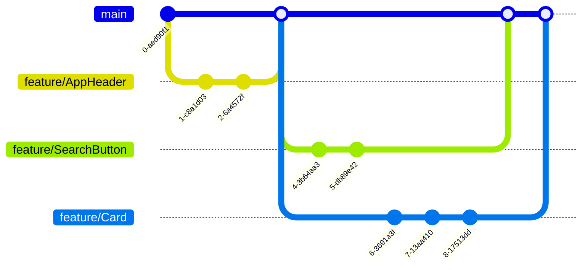

## Git workflow

You will use a [feature branch workflow](https://www.atlassian.com/git/tutorials/comparing-workflows/feature-branch-workflow) for this project. This means that you will create a new branch for each ticket you work on. When you are done with the ticket, you will open a PR and your team will review your work. Once approved, you will merge the branch into `main`.

You should be familiar with this workflow by now. Let's put it to the test by working on many different components at the same time, in a real Agile team.

## Components

Make your components in the `src/components` folder. Organize your components into sub-folders and keep everything tidy. There are examples given for you to follow.

## Styling

There's a starter stylesheet set up. It uses [sass](https://sass-lang.com/guide/), which is a way of writing complicated CSS more easily. You can write plain CSS in any `.scss` file, so you don't have to learn SASS to do this project. (But you might want to learn it anyway, because it's awesome.)

If you don't like these styles, you can replace them with your own. You can also use pre-made stylesheets from [Tailwind](https://tailwindcss.com/), [Bootstrap](https://getbootstrap.com/), or any other CSS framework you like. But focus on the functionality first, and worry about the styling later.
