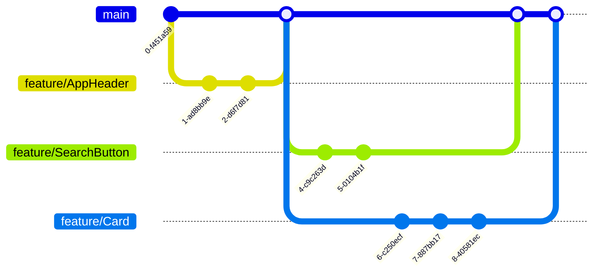

# The React Hotel

## Description

This is a hotel website you will build with your team.

1. One person should fork this repo to their own GitHub account.
1. That person should add the other team members as collaborators to the repo.
1. Now someone else should make a copy of the example planner and link it to your project repo.
1. All the tickets for your project are created as issues in this repo. Batch clone the tickets into your project planner.

## Git workflow

You will use a [feature branch workflow](https://www.atlassian.com/git/tutorials/comparing-workflows/feature-branch-workflow) for this project. This means that you will create a new branch for each ticket you work on. When you are done with the ticket, you will open a PR and your team will review your work. Once approved, you will merge the branch into `main`.



You should be familiar with this workflow by now. Let's put it to the test by working on many different components at the same time, in a real Agile team.

## Project Setup

This project uses [Vite](https://vitejs.dev/guide/), a modern build tool for React. To run the project, you will need to install the dependencies. In a terminal in the root of the project, run:

```zsh
npm install
```

Then you can start the development server:

```zsh
npm run dev
```

It will open a browser window at [http://localhost:5173/](http://localhost:5173/) and a test runner at [http://localhost:51205/**vitest**/#/](http://localhost:51205/__vitest__/#/).

## Project Architecture

### Components

Make your components in the `src/components` folder. Organize your components into subfolders and keep everything tidy. There are examples given for you to follow.

### Tests

The test runner is called [Vitest](https://vitest.dev/) and it's set up to run tests in the `src` folder. You can add more tests in the `src` folder and they will be picked up by Vitest, so long as you name them with the `.test.jsx` extension. Make sure to use the `.jsx` extension, not `.js`.

You can write tests using the same Jest syntax you have already learned in these files.

The [React Testing Library](https://testing-library.com/docs/react-testing-library/intro/) is also available in the tests, and the docs are a great resource for learning how to use it.

You will need to write a test for each component you build. Write the test first, based on the requirements given in the ticket. Then write the component to make the test pass.

There are some examples given to help you. Come to class with questions about how to write tests.

### Styling

There's a starter stylesheet set up. It uses [sass](https://sass-lang.com/guide/), which is a way of writing complicated CSS more easily. You can write plain CSS in any `.scss` file, so you don't have to learn SASS to do this project. (But you might want to learn it anyway, because it's awesome.)

If you don't like these styles, you can replace them with your own. You can also use premade stylesheets from [Tailwind](https://tailwindcss.com/), [Bootstrap](https://getbootstrap.com/), or any other CSS framework you like. But focus on the functionality first, and worry about the styling later.
